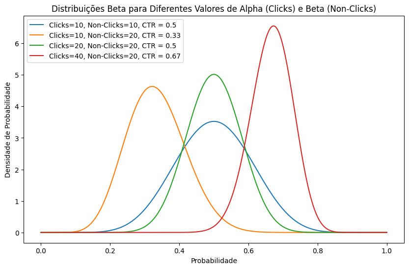

# Welcome to your new MABExperiment-API project!

This project utilizes **Docker**, **RestfulAPI**, **SQL Database** and **MAB Algorithm**  for data transformation and analysis. The following instructions will guide you through setting up your environment and running the project.

### Project Idea

Thompson Sampling is a probabilistic algorithm used in A/B testing and Multi-Armed Bandit problems to dynamically allocate traffic between different variants based on their observed performance. The algorithm models the uncertainty of each variant's performance using a Beta distribution, which takes the number of clicks (successes) and non-clicks (failures) as inputs.

For each variant, Thompson Sampling draws a random sample from its Beta distribution, where the shape of the distribution is determined by the ratio of clicks to non-clicks. The variant with the highest sampled value is selected to receive more traffic in the next iteration. This approach balances exploration (testing underperforming variants) and exploitation (favoring the better-performing variant).

The plot below shows how the Beta distribution evolves with different combinations of clicks and non-clicks. As the number of clicks increases, the distribution becomes sharper and more confident about the true CTR (Click-Through Rate), shifting towards higher probabilities.



### Project Structure

```bash

MABExperiment-API/
├── app/
│   ├── app.py              # Main Flask application file
│   ├── routes.py           # Routes defining the API endpoints
│   ├── config.py           # Application configurations, including database connections
│   ├── db_connection.py    # Database connection function
│   └── __init__.py         # Initialization of the Flask application
├── analytics.ipynb         # Script that plots the data
├── data_input.py           # Script that inserts data into the database for the experiments
├── docker-compose.yml      # Docker configuration file for the application and PostgreSQL
├── Dockerfile              # Dockerfile to build the API image
├── requirements.txt        # Project dependencies
└── schema.sql              # SQL script to create the database tables
└── add_experiment_data.json   # JSON example for POST experiment data
└── create_allocation.json  # JSON example for POST allocation

```

The flowchart below illustrates the data flow between the components of the MABExperiment API:


### API Endpoints 

Here are the main API endpoints:

- `POST /experiment_data`: Inserts impression and click data for a control page and variant page.
- `POST /allocations`: Calculates and saves traffic allocation between the variants.
- `GET /allocations`: Retrieves the most recent allocations for an experiment.

You can use tools like Postman or cURL to interact with these endpoints.

### Inserting Data into the Database with `data_input.py`

The data_input.py script is used to insert data for variants in a specific experiment. It generates random records for impressions and clicks, which are sent to the database via API.

To run the script, simply use the following command:

```bash
python data_input.py
```

## Getting Started

### 1. Install Docker

Docker is required to run the project. You can install Docker Compose (which includes Docker) on your system by following these steps:

1. Install **Docker Compose**:
   ```bash
   sudo apt install docker-compose
   ```

2. Verify Docker installation:
   ```bash
   docker --version
   docker-compose --version
   ```

### 2. Set up your MABExperiment-API environment

Once Docker is installed, follow these steps to set up your **MABExperiment-API** environment:

#### 2.1 Clone the repository

Start by cloning the repository to your local machine:
```bash
git clone git@github.com:joaoabal/MABExperiment-API.git
cd MABExperiment-API
```

#### 2.2 Create a virtual environment (optional but recommended)

You can create a Python virtual environment to manage dependencies:

```bash
python -m venv venv
source venv/bin/activate  # On Windows use: venv\Scripts\activate
```

#### 2.3 Install MABExperiment-API dependencies

After activating your virtual environment, install any necessary dependencies by running:

```bash
pip install -r requirements.txt
```

#### 2.4 Configure MABExperiment-API profiles

Here is an example configuration for PostgreSQL:

```
Resumo dos Dados para Conexão
Host: localhost (ou o IP da máquina host)
Porta: 5433
Database: mab_db
Username: postgres
Password: password
```


### 3. Running MABExperiment-API in Docker

This project uses Docker to run **API** and PostgreSQL in containers. You can manage the containers using **Docker Compose**.

#### 3.1 Build and run the containers

To build and start the dbt environment in Docker:

```bash
sudo docker-compose up --build
```

This command will start both the dbt container and the PostgreSQL container as specified in the `docker-compose.yml`.

### 4. Additional commands

#### Stopping containers
To stop the running containers, execute:

```bash
sudo docker-compose down
sudo docker volume rm mabexperiment-api_postgres_data
```

#### Rebuilding containers
If you make changes to the Dockerfile or `docker-compose.yml`, you may need to rebuild the containers:

```bash
docker-compose up --build
```

