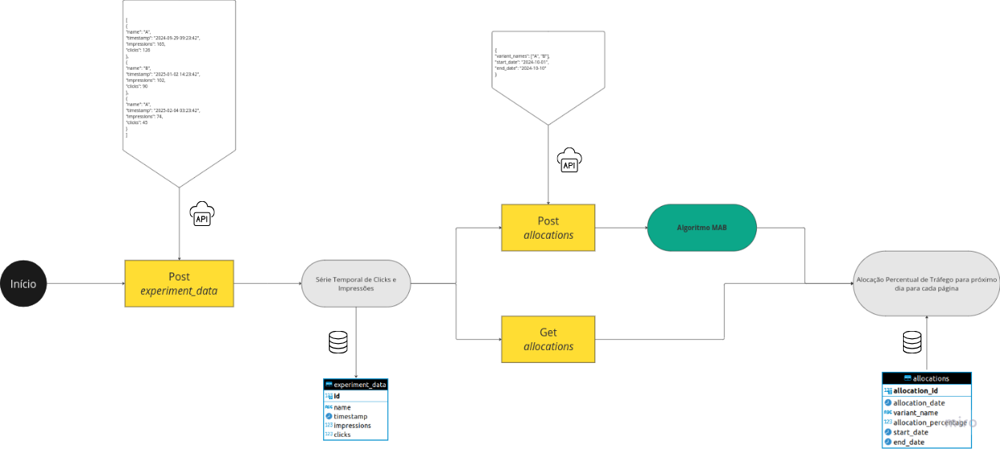

# Welcome to your new MABExperiment-API project!

This project utilizes **Docker**, **RestfulAPI**, **SQL Database** and **MAB Algorithm**  for data transformation and analysis. The following instructions will guide you through setting up your environment and running the project.


### Estrutura do Projeto

```bash
MABExperiment-API/
├── app/
│   ├── app.py              # Arquivo principal da aplicação Flask
│   ├── routes.py           # Rotas que definem os endpoints da API
│   ├── config.py           # Configurações da aplicação, incluindo conexões de banco de dados
│   └── __init__.py         # Inicialização da aplicação Flask
├── data_input.py           # Script que insere dados no banco de dados para os experimentos
├── docker-compose.yml      # Arquivo de configuração Docker para a aplicação e PostgreSQL
├── Dockerfile              # Dockerfile para construir a imagem da API
├── requirements.txt        # Dependências do projeto
└── schema.sql              # Script SQL para criar as tabelas no banco de dados
```

O fluxograma abaixo ilustra o fluxo de dados entre os componentes da API MABExperiment:





### Endpoints da API

Aqui estão os principais endpoints da API:

- `POST /experiments`: Cria um novo experimento.
- `POST /experiments/<experiment_id>/variants`: Adiciona variantes ao experimento.
- `POST /experiment_data`: Insere dados de impressões e cliques para uma variante.
- `POST /allocations`: Calcula e salva a alocação de tráfego entre as variantes.
- `GET /allocations/<experiment_id>`: Retorna as alocações mais recentes para um experimento.

Você pode utilizar ferramentas como **Postman** ou **cURL** para interagir com esses endpoints.

### Inserindo Dados no Banco com `data_input.py`

O script `data_input.py` é utilizado para inserir dados de variantes em um experimento específico. Ele gera registros aleatórios de impressões e cliques, que são enviados para o banco de dados via API.

Para executá-lo, basta rodar o seguinte comando:

```bash
python data_input.py
```

## Getting Started

### 1. Install Docker

Docker is required to run the project. You can install Docker Compose (which includes Docker) on your system by following these steps:

1. Install **Docker Compose**:
   ```bash
   sudo apt install docker-compose
   ```

2. Verify Docker installation:
   ```bash
   docker --version
   docker-compose --version
   ```

### 2. Set up your MABExperiment-API environment

Once Docker is installed, follow these steps to set up your **MABExperiment-API** environment:

#### 2.1 Clone the repository

Start by cloning the repository to your local machine:
```bash
git clone https://github.com/your-repo/MABExperiment-API.git
cd MABExperiment-API
```

#### 2.2 Create a virtual environment (optional but recommended)

You can create a Python virtual environment to manage dependencies:

```bash
python -m venv venv
source venv/bin/activate  # On Windows use: venv\Scripts\activate
```

#### 2.3 Install MABExperiment-API dependencies

After activating your virtual environment, install any necessary dependencies by running:

```bash
pip install -r requirements.txt
```

#### 2.4 Configure MABExperiment-API profiles

Here is an example configuration for PostgreSQL:

```
Resumo dos Dados para Conexão
Host: localhost (ou o IP da máquina host)
Porta: 5433
Database: mab_db
Username: postgres
Password: password
```
----------------------------


### 3. Running MABExperiment-API in Docker

This project uses Docker to run **API** and PostgreSQL in containers. You can manage the containers using **Docker Compose**.

#### 3.1 Build and run the containers

To build and start the dbt environment in Docker:

```bash
sudo docker-compose up --build
```

This command will start both the dbt container and the PostgreSQL container as specified in the `docker-compose.yml`.

---- FALAR SOBRE MIGRATION -> foi atumatizada.

sudo docker-compose exec mab-api flask db init
sudo docker-compose exec mab-api flask db migrate -m "Initial migration."

---- falar sobre data_input.py que insere os dados no banco

---- falar sobre os endpoints

### 4. Additional commands

#### Stopping containers
To stop the running containers, execute:

```bash
sudo docker-compose down
sudo docker volume rm mab-api_postgres_data
```

#### Rebuilding containers
If you make changes to the Dockerfile or `docker-compose.yml`, you may need to rebuild the containers:

```bash
docker-compose up --build
```

